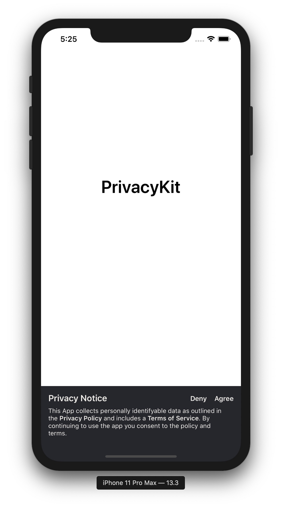

# PrivacyKit

[](https://travis-ci.org/ithazfire/PrivacyKit/settings)
[](https://cocoapods.org/pods/PrivacyKit)
[](https://cocoapods.org/pods/PrivacyKit)
[](https://cocoapods.org/pods/PrivacyKit)
[](https://coveralls.io/github/ithazfire/PrivacyKit?branch=master)
[](https://app.codacy.com/gh/ithazfire/PrivacyKit?utm_source=github.com&utm_medium=referral&utm_content=ithazfire/PrivacyKit&utm_campaign=Badge_Grade_Dashboard)

## Example

To run the example project, clone the repo, and run `pod install` from the Example directory first.



## Installation

PrivacyKit is available through [CocoaPods](https://cocoapods.org). To install
it, simply add the following line to your Podfile:

```ruby
pod 'PrivacyKit'
```

## Basic Usage

To configure PrivacyKit globally, do so from the
`AppDelegate.application(didFinishLaunchingWithOptions)` function.

```swift
@UIApplicationMain
class AppDelegate: UIResponder, UIApplicationDelegate {

    var window: UIWindow?

    func application(_ application: UIApplication, didFinishLaunchingWithOptions launchOptions: [UIApplicationLaunchOptionsKey: Any]?) -> Bool {

        /** Configure PrivacyKit Globally */
        PrivacyKit.shared.config("https://github.com/ithazfire/PrivacyKit")

        // Override point for customization after application launch.
        return true
    }
}
```

To present the PrivacyKit UIViewController add the delegate to your `UIViewController`
and call the `requirePrivacy()` function.

```swift
class ViewController: UIViewController, PrivacyKitDelegate {
    override func viewDidAppear(_ animated: Bool) {
        /** Present the PrivacyKit View if Privacy is not accepted. */
        self.requirePrivacy()
    }
}
```

## Author

[Archdoog](https://github.com/Archdoog)

## License

PrivacyKit is available under the MIT license. See the LICENSE file for more info.
